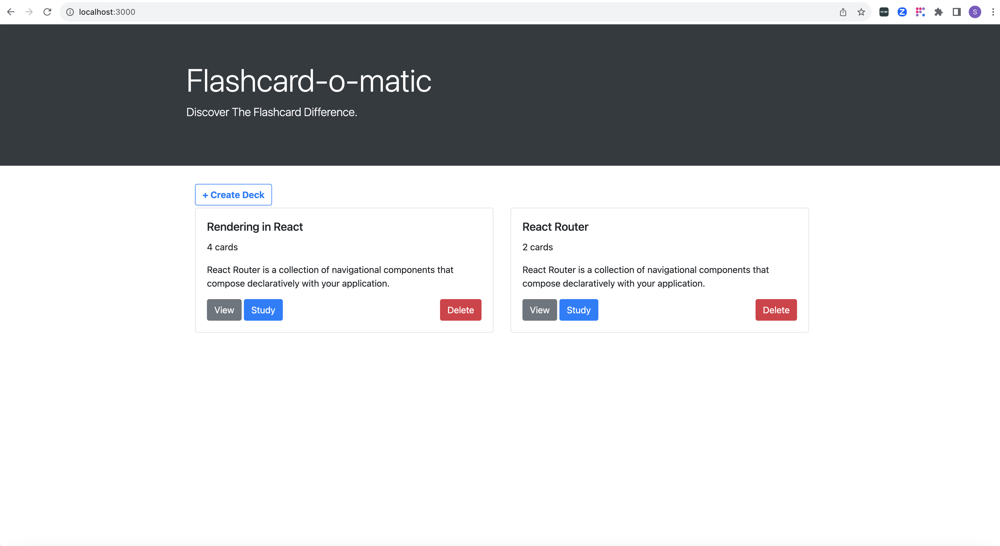
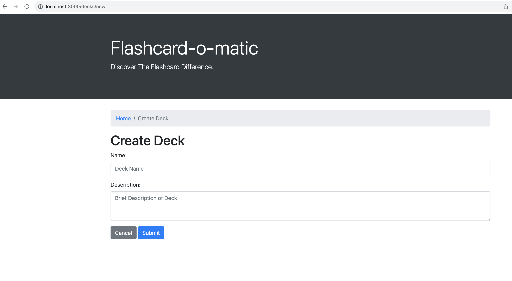
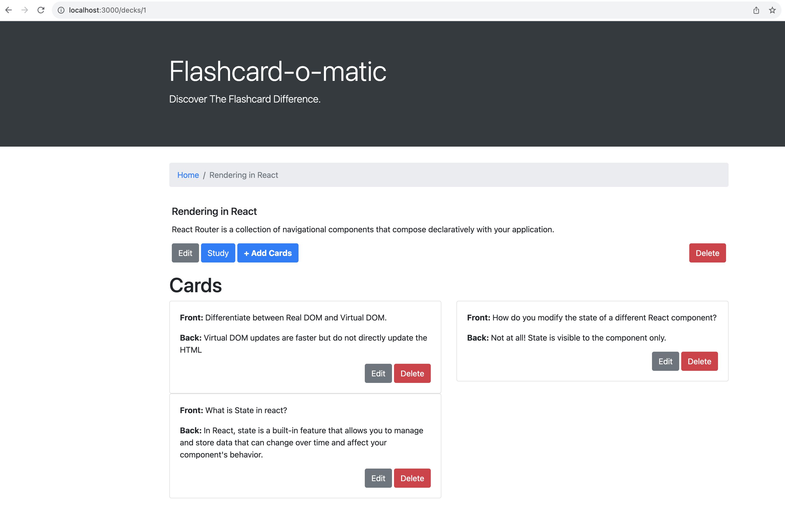
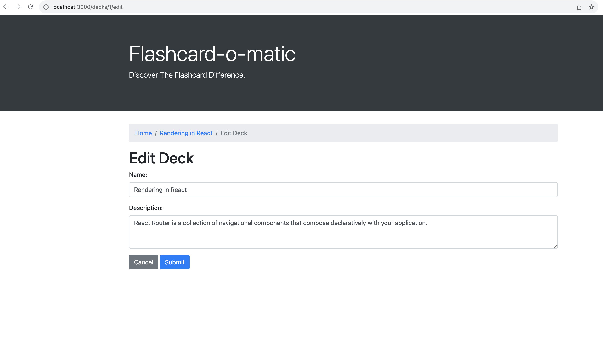
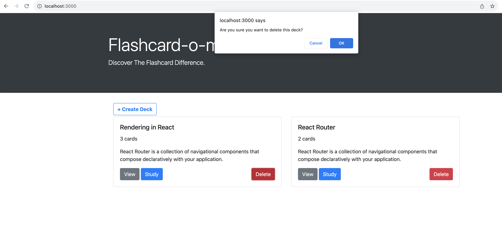
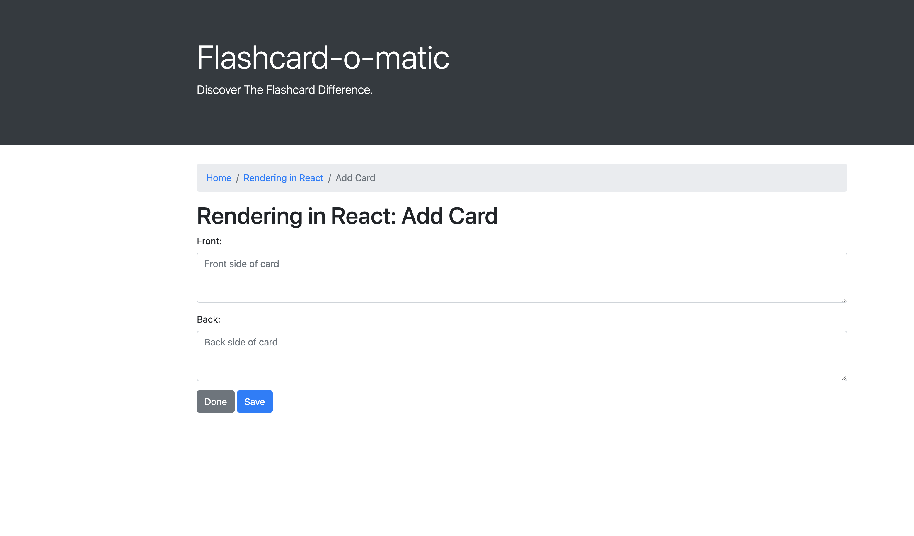
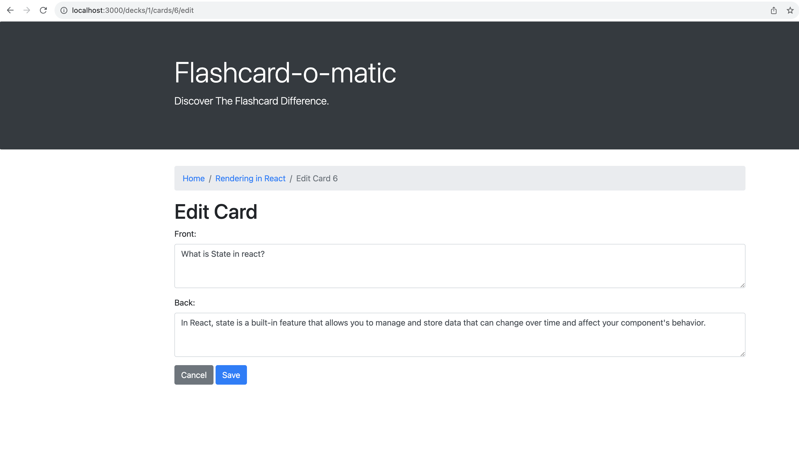
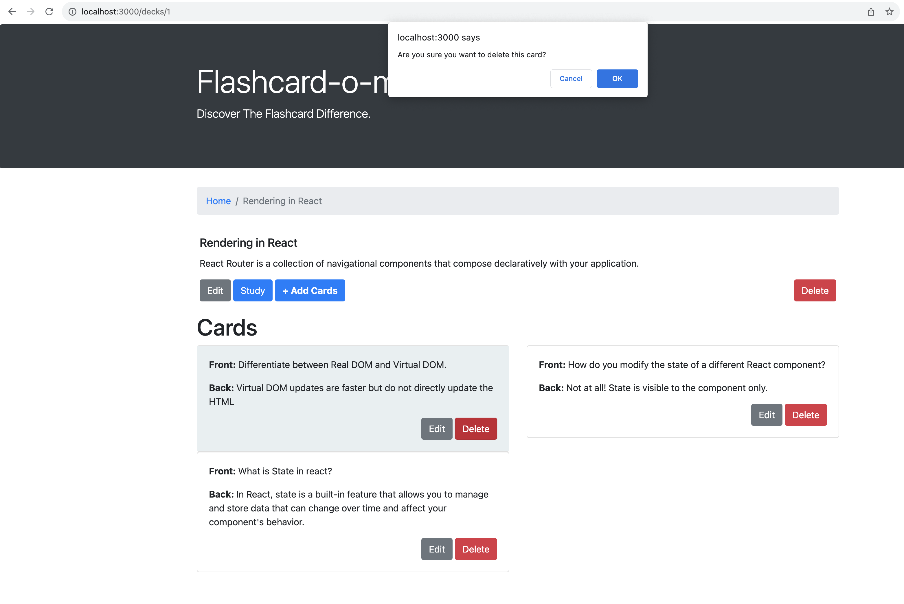
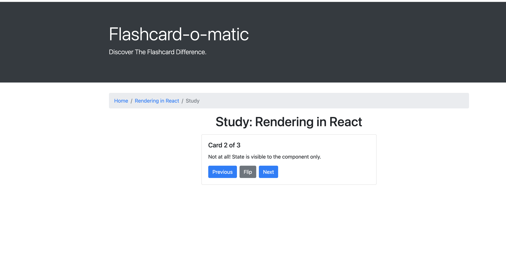

# Flashcard-o-matic


## Table of Contents
- [Description](#description)
- [Getting Started](#getting-started)
- [Prerequisites](#prerequisites)
- [Installing](#installing)
- [Running the Application](#running-the-application)
- [Features and Usage](#features-and-usage)

## Description
This is a simple online learning tool designed to help students study course content with flashcards.

## Getting Started

The below instructions will help you get a copy of the project up and running on your local machine for development and testing purposes.

## Prerequisites

Ensure the below minimum tools are installed in your machine already
- Node.js
- npm (Node Package Manager)
- Download Visual Studio Code

## Installing

A step-by-step series of examples that tell you how to get a development environment up and running.

```bash
# Clone the repository
git clone https://github.com/SakethShakkari/flashcard-o-matic

# Navigate to the project directory
cd <FIle System Directory>/repo-name


# Install dependencies
npm install
``````

## Running the Application

start the server
``````
npm start
``````

The application should now be running at http://localhost:3000.

# Features and Usage

Follow the below steps to use the application
### Home
- Home page will be displayed as below



- **Create Deck**: input a deck name and brief description; users will then be directed to the deck page

- **View**: directs users to the deck page where they can get an overview of deck contents

- **Study**: directs users to an interactive study session with the deck's flashcards

- **Delete**: users also have the option to delete the deck and all of its contents







- **Edit**: users are able to edit the deck name and description
- **Study**: enter study mode
- **Add Cards**: add individual cards to a selected deck
- **Delete**: Delete deck







#### Cards

- **Edit**: Edit card front and back
- **Delete**: Delete card





### Study

- **Flip**: view the back of the card
- **Next**: view the next card
- **Previous**: view the previous card


